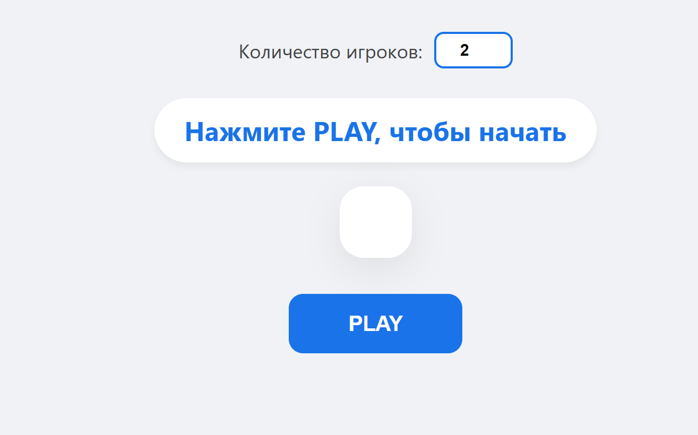
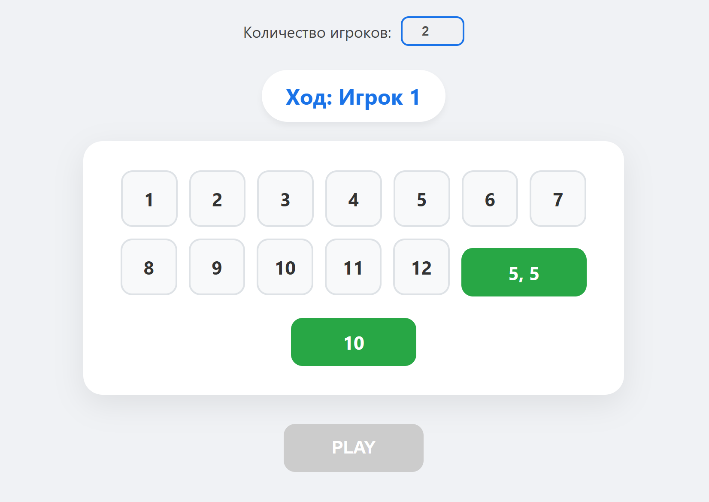

# 🔍 GAME 12

> 🚀 **Live Demo:** [Watch the demo in the browser](https://voldy831.github.io/javascript-project/)

# 🎲 Shut the Box (Game 12)

A clean, interactive web-based adaptation of the classic dice-board game **Shut the Box** built with Vanilla JavaScript, HTML5, and CSS3.

---

## 📋 About the Game

**Game 12** is a turn-based multiplayer board game where players roll two virtual 6-sided dice and strategic choices to eliminate numbers from 1 to 12.

The primary objective is to clear all numbers on your board before other players do, or have the fewest total remaining points when no valid moves are left.

### 🎮 How to Play

1. **Setup**: Select the number of players (from 1 to 5) and click **PLAY**.
2. **Turn Mechanics**:
   - On each turn, two dice are automatically rolled.
   - You can choose to eliminate either:
     - **Individual numbers** matching the rolled dice values (e.g., if you roll 3 and 5, you can clear 3 and 5 if available).
     - **The sum** of the two dice (e.g., rolling 3 and 5 allows you to clear 8).
3. **No Available Moves**: If a player cannot make a valid selection based on the current roll, their turn is automatically skipped.
4. **Game Over**:
   - **Victory**: A player successfully clears all numbers (1–12).
   - **Draw/End**: Consecutive skips equal to the number of players end the game when no player can make further moves.

---

## ✨ Features

- 👥 **Multiplayer Support**: Dynamic state management supporting 1 to 5 players.
- 🎲 **Automated Dice Rolling**: Random roll generation with automatic validation of valid moves.
- 🎨 **Modern UI/UX**: Clean layout featuring interactive visual indicators for selected numbers and active buttons.
- ⚡ **Pure Vanilla JS**: Zero external dependencies or frameworks for maximum performance.

---

## 🛠️ Tech Stack

- **HTML5**: Semantic markup for game structures and input controls.
- **CSS3**: Modern Flexbox layouts, smooth hover transitions, and dynamic visual styling.
- **JavaScript (ES6+)**: DOM manipulation, event management, state tracking, and turn-based game logic.

---
